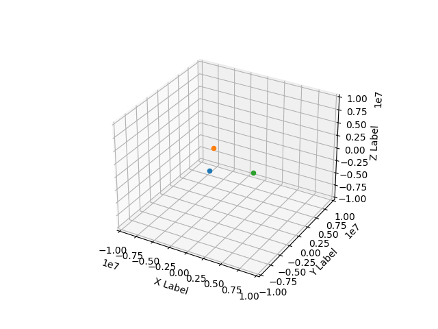

# N-body Model

By ([mirluvams](https://github.com/mirluvams)) ([mirluvams@gmail.com](mailto:mirluvams@gmail.com)), student at [*Escuela Nacional de Estudios Superiores*, campus Morelia](https://www.enesmorelia.unam.mx/), [UNAM](https://www.unam.mx/).

## Problem
This problem consists in modifying the orignal code provided for Dr. Victor de la Luz showcased in the Modeling and Simulation 2023-1 class taught by Dr. [Victor de la Luz](https://github.com/itztli). Following the next steps:

> 1) Define a range for a cube of MxMxM meters (you choose M) and where Vmax is the maximum speed allowed in the system (in m/s).
>
> 2) Modify the original code provided for Dr. Victor de la Luz so that it accepts N particles and initializes them with random positions within the cube. For this exercise the mass must be fixed. The initial velocities must also be random and not exceed Vmax.
>
> 3) Find the best conditions for dt and the number of iterations to show that the system is in motion.

## References
De la Luz, V. (2022). Class: Modeling and Simulation 2023-1. [ENES Unidad Morelia](https://www.enesmorelia.unam.mx/).

## Results

